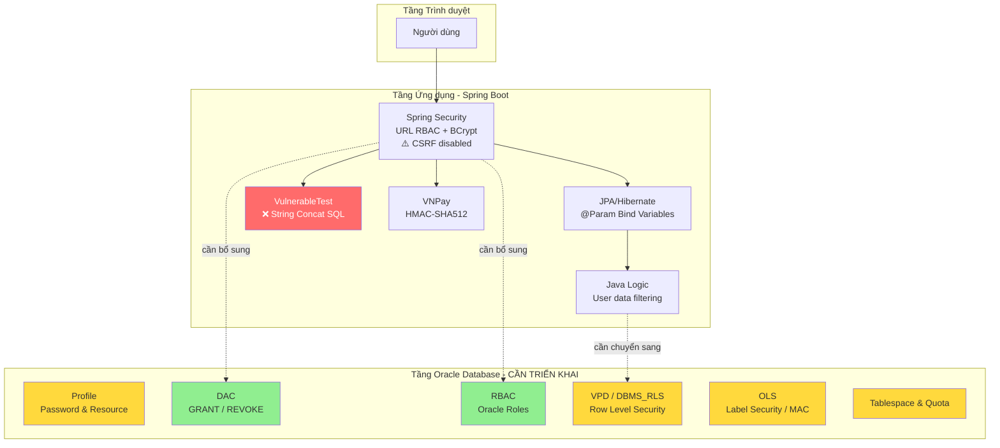

# TỔNG HỢP CHỨC NĂNG WEB WEBALOTRA — ÁNH XẠ BẢO MẬT ORACLE

> [!CAUTION]
> **Phát hiện quan trọng:** Dự án đang kết nối **SQL Server** (`jdbc:sqlserver://localhost:1433`), KHÔNG phải Oracle. Cần **chuyển đổi** datasource sang Oracle (`jdbc:oracle:thin:@localhost:1521:xe`) và thay đổi Hibernate dialect sang `OracleDialect` để phù hợp yêu cầu đồ án. Các native query trong Repository cũng cần chuyển đổi hàm SQL Server (`CONVERT`, `GETDATE`, `FORMAT`, `DATEDIFF`) sang hàm Oracle (`TO_CHAR`, `SYSDATE`, `TO_DATE`, `EXTRACT`).

---

## TỔNG QUAN HỆ THỐNG

| Thuộc tính | Chi tiết |
|---|---|
| **Framework** | Spring Boot 2.7.14 + Spring Security 5 + Thymeleaf |
| **Database hiện tại** | ⚠️ SQL Server 2012 (`mssql-jdbc`) |
| **Database mục tiêu** | ✅ Oracle (`ojdbc`) |
| **ORM** | JPA / Hibernate |
| **Vai trò** | `ROLE_GUEST`, `ROLE_USER`, `ROLE_VENDOR`, `ROLE_ADMIN` |
| **Thanh toán** | VNPay (HMAC-SHA512) |
| **Real-time** | WebSocket STOMP |
| **Quan hệ Role** | ManyToOne (1 account → 1 role) |
| **Login bằng** | Email (không phải username) |

---

## 1. NHÓM: XÁC THỰC & QUẢN LÝ TÀI KHOẢN

### 1.1 Đăng nhập / Đăng xuất

| Thuộc tính | Chi tiết |
|---|---|
| **Nhóm chức năng** | Xác thực người dùng |
| **File Java chính** | [AuthController.java](file:///C:/Users/TOAN%20TIEN%20COMPUTER/.gemini/antigravity/worktrees/Web_FinalProject/audit-oracle-security-features/src/main/java/com/project/WebAloTra/controller/user/AuthController.java), [WebSecurityConfig.java](file:///C:/Users/TOAN%20TIEN%20COMPUTER/.gemini/antigravity/worktrees/Web_FinalProject/audit-oracle-security-features/src/main/java/com/project/WebAloTra/security/WebSecurityConfig.java), [CustomUserDetailsService.java](file:///C:/Users/TOAN%20TIEN%20COMPUTER/.gemini/antigravity/worktrees/Web_FinalProject/audit-oracle-security-features/src/main/java/com/project/WebAloTra/security/CustomUserDetailsService.java) |
| **Endpoint** | `GET /user-login`, `POST /user_login`, `GET /user_logout` |
| **Mô tả** | Form-based login (email làm username), remember-me 7 ngày, BCrypt password, logout xóa session, redirect theo role |
| **Oracle thay thế / Cơ chế BM** | `BCryptPasswordEncoder` mã hóa mật khẩu → tương đương **Oracle Profile** (`PASSWORD_LIFE_TIME`, `PASSWORD_REUSE_TIME`); Query `findByEmail()` dùng JPA derived query (parameterized) |
| **Thuộc lớp bảo mật** | **1. Quản lý Người dùng & Profile** + **3. Phòng chống SQL Injection** |
| **Ghi chú thêm** | CSRF bị **DISABLE**; Frame Options bị **DISABLE**; `anyRequest().permitAll()` cho mọi URL không match |

### 1.2 Đăng ký tài khoản + Xác thực Email OTP

| Thuộc tính | Chi tiết |
|---|---|
| **Nhóm chức năng** | Tạo tài khoản mới |
| **File Java chính** | [AuthController.java](file:///C:/Users/TOAN%20TIEN%20COMPUTER/.gemini/antigravity/worktrees/Web_FinalProject/audit-oracle-security-features/src/main/java/com/project/WebAloTra/controller/user/AuthController.java), [VerificationCodeServiceImpl.java](file:///C:/Users/TOAN%20TIEN%20COMPUTER/.gemini/antigravity/worktrees/Web_FinalProject/audit-oracle-security-features/src/main/java/com/project/WebAloTra/service/serviceImpl/VerificationCodeServiceImpl.java), [AccountServiceImpl.java](file:///C:/Users/TOAN%20TIEN%20COMPUTER/.gemini/antigravity/worktrees/Web_FinalProject/audit-oracle-security-features/src/main/java/com/project/WebAloTra/service/serviceImpl/AccountServiceImpl.java) |
| **Endpoint** | `GET /register`, `POST /register-save`, `GET /verify-otp`, `POST /verify-otp`, `POST /resend-otp` |
| **Mô tả** | Đăng ký → gửi OTP 6 ký tự qua email → hết hạn 15 phút → xác thực → tạo Account + Customer, BCrypt hash password |
| **Oracle thay thế / Cơ chế BM** | `BCryptPasswordEncoder`, validation email/phone unique, OTP single-use có thời hạn → tương đương **CREATE USER** + **Profile** ràng buộc mật khẩu |
| **Thuộc lớp bảo mật** | **1. Quản lý Người dùng & Profile** |
| **Ghi chú thêm** | Không có rate limiting trên endpoint gửi OTP |

### 1.3 Quên mật khẩu / Đặt lại mật khẩu

| Thuộc tính | Chi tiết |
|---|---|
| **Nhóm chức năng** | Khôi phục tài khoản |
| **File Java chính** | [AuthController.java](file:///C:/Users/TOAN%20TIEN%20COMPUTER/.gemini/antigravity/worktrees/Web_FinalProject/audit-oracle-security-features/src/main/java/com/project/WebAloTra/controller/user/AuthController.java), [VerificationCodeController.java](file:///C:/Users/TOAN%20TIEN%20COMPUTER/.gemini/antigravity/worktrees/Web_FinalProject/audit-oracle-security-features/src/main/java/com/project/WebAloTra/controller/api/VerificationCodeController.java) |
| **Endpoint** | `GET /forgot-pass`, `POST /reset-page`, `GET /reset-pass`, `POST /reset-password` |
| **Mô tả** | Nhập email → gửi OTP → xác thực → đổi mật khẩu mới (BCrypt encode) |
| **Oracle thay thế / Cơ chế BM** | Tương đương chính sách **Profile** (`PASSWORD_LOCK_TIME`, `FAILED_LOGIN_ATTEMPTS`) |
| **Thuộc lớp bảo mật** | **1. Quản lý Người dùng & Profile** |

### 1.4 Quản lý tài khoản (Admin CRUD)

| Thuộc tính | Chi tiết |
|---|---|
| **Nhóm chức năng** | Quản trị tài khoản |
| **File Java chính** | [AccountMngController.java](file:///C:/Users/TOAN%20TIEN%20COMPUTER/.gemini/antigravity/worktrees/Web_FinalProject/audit-oracle-security-features/src/main/java/com/project/WebAloTra/controller/admin/AccountMngController.java), [AccountServiceImpl.java](file:///C:/Users/TOAN%20TIEN%20COMPUTER/.gemini/antigravity/worktrees/Web_FinalProject/audit-oracle-security-features/src/main/java/com/project/WebAloTra/service/serviceImpl/AccountServiceImpl.java) |
| **Endpoint** | `GET /admin-only/account-management`, `POST /account/block/{id}`, `POST /account/open/{id}`, `POST /account/change-role` |
| **Mô tả** | Liệt kê tài khoản, khóa/mở khóa (`isNonLocked`), thay đổi role, xem vendor chưa gán chi nhánh |
| **Oracle thay thế / Cơ chế BM** | Khóa tài khoản → tương đương **ALTER USER ... ACCOUNT LOCK/UNLOCK**; Gán Role → **GRANT role TO user / REVOKE role FROM user** |
| **Thuộc lớp bảo mật** | **2. Kiểm soát truy cập DAC + RBAC** |

### 1.5 Hồ sơ người dùng (User Profile)

| Thuộc tính | Chi tiết |
|---|---|
| **Nhóm chức năng** | Quản lý thông tin cá nhân |
| **File Java chính** | [UserProfileController.java](file:///C:/Users/TOAN%20TIEN%20COMPUTER/.gemini/antigravity/worktrees/Web_FinalProject/audit-oracle-security-features/src/main/java/com/project/WebAloTra/controller/user/UserProfileController.java), [AccountServiceImpl.java](file:///C:/Users/TOAN%20TIEN%20COMPUTER/.gemini/antigravity/worktrees/Web_FinalProject/audit-oracle-security-features/src/main/java/com/project/WebAloTra/service/serviceImpl/AccountServiceImpl.java) |
| **Endpoint** | `GET /profile`, `POST /update-profile`, `POST /change-password` |
| **Mô tả** | Xem/sửa profile, đổi mật khẩu (verify mật khẩu cũ trước), kiểm tra trùng số điện thoại |
| **Oracle thay thế / Cơ chế BM** | User chỉ truy cập dữ liệu mình qua `UserLoginUtil.getCurrentLogin()` → tương đương **VPD/RLS** (predicate `WHERE account_id = :current_user`) |
| **Thuộc lớp bảo mật** | **4. VPD - Row Level Security** |
| **Ghi chú thêm** | Hiện triển khai bằng logic Java, chưa dùng `DBMS_RLS` của Oracle |

---

## 2. NHÓM: PHÂN QUYỀN & KIỂM SOÁT TRUY CẬP

### 2.1 Phân quyền theo URL (RBAC)

| Thuộc tính | Chi tiết |
|---|---|
| **Nhóm chức năng** | Kiểm soát truy cập |
| **File Java chính** | [WebSecurityConfig.java](file:///C:/Users/TOAN%20TIEN%20COMPUTER/.gemini/antigravity/worktrees/Web_FinalProject/audit-oracle-security-features/src/main/java/com/project/WebAloTra/security/WebSecurityConfig.java) |
| **Cấu hình chi tiết** | **Public**: `/`, `/home/**`, `/product/**`, `/about/**`, `/contact/**`; **USER+VENDOR+ADMIN**: `/profile/**`, `/orders/**`, `/checkout/**`, `/cart/**`, `/payment/**`; **VENDOR+ADMIN**: `/admin/thong-ke-doanh-thu`, `/admin/bill-list`, `/admin/product-all/create`, `/admin/brand-*`, `/admin/size-*`, `/admin/color-*`, `/admin/pos`, `/admin-only/bill-return*`; **ADMIN only**: `/admin/**`, `/management/**`, `/system/**` |
| **Oracle thay thế / Cơ chế BM** | Spring Security URL-based → tương đương **CREATE ROLE** + **GRANT privileges ON objects TO role** |
| **Thuộc lớp bảo mật** | **2. RBAC - Role-Based Access Control** |
| **Ghi chú thêm** | `anyRequest().permitAll()` = mọi URL không match đều public → nhiều API endpoint bị lộ |

### 2.2 Hệ thống Role (4 vai trò)

| Thuộc tính | Chi tiết |
|---|---|
| **Nhóm chức năng** | Quản lý vai trò |
| **File Java chính** | [Role.java](file:///C:/Users/TOAN%20TIEN%20COMPUTER/.gemini/antigravity/worktrees/Web_FinalProject/audit-oracle-security-features/src/main/java/com/project/WebAloTra/entity/Role.java), [CustomUserDetails.java](file:///C:/Users/TOAN%20TIEN%20COMPUTER/.gemini/antigravity/worktrees/Web_FinalProject/audit-oracle-security-features/src/main/java/com/project/WebAloTra/security/CustomUserDetails.java), [Account.java](file:///C:/Users/TOAN%20TIEN%20COMPUTER/.gemini/antigravity/worktrees/Web_FinalProject/audit-oracle-security-features/src/main/java/com/project/WebAloTra/entity/Account.java) |
| **Mô tả** | Account → Role (ManyToOne, mỗi account 1 role); Enum `RoleName`: `ROLE_GUEST`, `ROLE_USER`, `ROLE_VENDOR`, `ROLE_ADMIN`; Prefix `ROLE_` tự động thêm |
| **Oracle thay thế / Cơ chế BM** | Bảng `role` enum-based → tương đương **Oracle Roles** (`CREATE ROLE role_admin/role_vendor/role_user`) |
| **Thuộc lớp bảo mật** | **2. RBAC** + **2. DAC** |

### 2.3 Method-level Security (Vendor)

| Thuộc tính | Chi tiết |
|---|---|
| **Nhóm chức năng** | Phân quyền cấp phương thức |
| **File Java chính** | [VendorStatisticController.java](file:///C:/Users/TOAN%20TIEN%20COMPUTER/.gemini/antigravity/worktrees/Web_FinalProject/audit-oracle-security-features/src/main/java/com/project/WebAloTra/controller/vendor/VendorStatisticController.java) |
| **Mô tả** | **Duy nhất** controller sử dụng `@PreAuthorize("hasAnyRole('VENDOR', 'ADMIN')")` |
| **Oracle thay thế / Cơ chế BM** | Tương đương **GRANT EXECUTE ON procedure TO role** |
| **Thuộc lớp bảo mật** | **2. DAC** |

---

## 3. NHÓM: QUẢN LÝ SẢN PHẨM & DANH MỤC

### 3.1 CRUD Sản phẩm (Admin)

| Thuộc tính | Chi tiết |
|---|---|
| **Nhóm chức năng** | Quản lý sản phẩm |
| **File Java chính** | [ProductController.java](file:///C:/Users/TOAN%20TIEN%20COMPUTER/.gemini/antigravity/worktrees/Web_FinalProject/audit-oracle-security-features/src/main/java/com/project/WebAloTra/controller/admin/ProductController.java) (13,184B), [ProductServiceImpl.java](file:///C:/Users/TOAN%20TIEN%20COMPUTER/.gemini/antigravity/worktrees/Web_FinalProject/audit-oracle-security-features/src/main/java/com/project/WebAloTra/service/serviceImpl/ProductServiceImpl.java), [ProductRepository.java](file:///C:/Users/TOAN%20TIEN%20COMPUTER/.gemini/antigravity/worktrees/Web_FinalProject/audit-oracle-security-features/src/main/java/com/project/WebAloTra/repository/ProductRepository.java) |
| **Endpoint** | `GET /admin/product-all`, `GET/POST /admin/product-create/*`, `GET/POST /admin/product-edit/*`, `POST /admin/product-save`, `GET /admin/product-delete/{id}` |
| **Mô tả** | Multi-step wizard (Part1: thông tin cơ bản → Part2: chi tiết biến thể), upload ảnh Cloudinary, quản lý size/color/material/brand/category, `@Transactional` |
| **Oracle thay thế / Cơ chế BM** | Native queries dùng `CONCAT('%',:param,'%')` (parameterized LIKE); chỉ VENDOR+ADMIN truy cập → **GRANT INSERT, UPDATE, DELETE ON products TO role_admin** |
| **Thuộc lớp bảo mật** | **2. DAC** + **3. Phòng chống SQL Injection** |

### 3.2 Duyệt / Tìm kiếm sản phẩm (User)

| Thuộc tính | Chi tiết |
|---|---|
| **Nhóm chức năng** | Xem sản phẩm |
| **File Java chính** | [ShopProductController.java](file:///C:/Users/TOAN%20TIEN%20COMPUTER/.gemini/antigravity/worktrees/Web_FinalProject/audit-oracle-security-features/src/main/java/com/project/WebAloTra/controller/user/ShopProductController.java), [HomeController.java](file:///C:/Users/TOAN%20TIEN%20COMPUTER/.gemini/antigravity/worktrees/Web_FinalProject/audit-oracle-security-features/src/main/java/com/project/WebAloTra/controller/user/HomeController.java), [ProductRestController.java](file:///C:/Users/TOAN%20TIEN%20COMPUTER/.gemini/antigravity/worktrees/Web_FinalProject/audit-oracle-security-features/src/main/java/com/project/WebAloTra/controller/api/ProductRestController.java) |
| **Endpoint** | `GET /`, `GET /getproduct`, `GET /product-detail/{code}`, `GET /api/products/**` |
| **Mô tả** | Trang chủ, phân trang, lọc (keyword, giá, danh mục, giới tính), sắp xếp, chi tiết sản phẩm, tìm bằng barcode |
| **Oracle thay thế / Cơ chế BM** | JPA Specification (dynamic parameterized queries); Public → **GRANT SELECT ON products TO PUBLIC** |
| **Thuộc lớp bảo mật** | **2. DAC** + **3. Phòng chống SQL Injection** |

### 3.3 Quản lý Danh mục / Thương hiệu / Màu / Size / Chất liệu / Topping

| Thuộc tính | Chi tiết |
|---|---|
| **Nhóm chức năng** | Quản lý thuộc tính sản phẩm |
| **File Java chính** | [CategoryController.java](file:///C:/Users/TOAN%20TIEN%20COMPUTER/.gemini/antigravity/worktrees/Web_FinalProject/audit-oracle-security-features/src/main/java/com/project/WebAloTra/controller/admin/CategoryController.java), [BrandController.java](file:///C:/Users/TOAN%20TIEN%20COMPUTER/.gemini/antigravity/worktrees/Web_FinalProject/audit-oracle-security-features/src/main/java/com/project/WebAloTra/controller/admin/BrandController.java), [ColorController.java](file:///C:/Users/TOAN%20TIEN%20COMPUTER/.gemini/antigravity/worktrees/Web_FinalProject/audit-oracle-security-features/src/main/java/com/project/WebAloTra/controller/admin/ColorController.java), [SizeController.java](file:///C:/Users/TOAN%20TIEN%20COMPUTER/.gemini/antigravity/worktrees/Web_FinalProject/audit-oracle-security-features/src/main/java/com/project/WebAloTra/controller/admin/SizeController.java), [MaterialController.java](file:///C:/Users/TOAN%20TIEN%20COMPUTER/.gemini/antigravity/worktrees/Web_FinalProject/audit-oracle-security-features/src/main/java/com/project/WebAloTra/controller/admin/MaterialController.java), [AdminToppingController.java](file:///C:/Users/TOAN%20TIEN%20COMPUTER/.gemini/antigravity/worktrees/Web_FinalProject/audit-oracle-security-features/src/main/java/com/project/WebAloTra/controller/admin/AdminToppingController.java) |
| **Endpoint** | `/admin/{entity}-all`, `/admin/{entity}-create`, `/admin/{entity}-save`, `/admin/{entity}-detail/{id}`, `/admin/{entity}-delete/{id}` |
| **Mô tả** | CRUD cho: Category, Brand, Color, Size, Material, Topping — phân trang + sắp xếp |
| **Oracle thay thế / Cơ chế BM** | JPA derived queries (parameterized); VENDOR+ADMIN truy cập |
| **Thuộc lớp bảo mật** | **2. DAC + RBAC** |

### 3.4 Quản lý Mã giảm giá / Khuyến mãi

| Thuộc tính | Chi tiết |
|---|---|
| **Nhóm chức năng** | Quản lý khuyến mãi |
| **File Java chính** | [DiscountCodeController.java](file:///C:/Users/TOAN%20TIEN%20COMPUTER/.gemini/antigravity/worktrees/Web_FinalProject/audit-oracle-security-features/src/main/java/com/project/WebAloTra/controller/admin/DiscountCodeController.java), [ProductDiscountController.java](file:///C:/Users/TOAN%20TIEN%20COMPUTER/.gemini/antigravity/worktrees/Web_FinalProject/audit-oracle-security-features/src/main/java/com/project/WebAloTra/controller/admin/ProductDiscountController.java), [DiscountCodeImpl.java](file:///C:/Users/TOAN%20TIEN%20COMPUTER/.gemini/antigravity/worktrees/Web_FinalProject/audit-oracle-security-features/src/main/java/com/project/WebAloTra/service/serviceImpl/DiscountCodeImpl.java) |
| **Endpoint** | `/admin-only/discount-code*`, `/admin/discount-code-save`, `/api/private/discount-code*` |
| **Mô tả** | CRUD mã giảm giá (FLAT/PERCENTAGE), thời hạn, đơn tối thiểu, giới hạn lượt, gán giảm giá sản phẩm |
| **Oracle thay thế / Cơ chế BM** | Business logic validation; VENDOR+ADMIN truy cập |
| **Thuộc lớp bảo mật** | **2. DAC** |

---

## 4. NHÓM: GIỎ HÀNG & ĐƠN HÀNG

### 4.1 Giỏ hàng (Shopping Cart)

| Thuộc tính | Chi tiết |
|---|---|
| **Nhóm chức năng** | Giỏ hàng |
| **File Java chính** | [ShoppingCartController.java](file:///C:/Users/TOAN%20TIEN%20COMPUTER/.gemini/antigravity/worktrees/Web_FinalProject/audit-oracle-security-features/src/main/java/com/project/WebAloTra/controller/user/ShoppingCartController.java), [CartServiceImpl.java](file:///C:/Users/TOAN%20TIEN%20COMPUTER/.gemini/antigravity/worktrees/Web_FinalProject/audit-oracle-security-features/src/main/java/com/project/WebAloTra/service/serviceImpl/CartServiceImpl.java) (21,931B) |
| **Endpoint** | `GET /shoping-cart`, `POST /api/addToCart`, `POST /api/deleteCart/{id}`, `POST /api/updateCart` |
| **Mô tả** | Hỗ trợ cả user (DB-backed) và guest (session-backed); thêm/xóa/sửa, topping, áp mã giảm, tính tổng, checkout |
| **Oracle thay thế / Cơ chế BM** | User chỉ truy cập giỏ mình qua `UserLoginUtil` → tương đương **VPD** (predicate `WHERE account_id = :current_user`) |
| **Thuộc lớp bảo mật** | **4. VPD - Row Level Security** |
| **Ghi chú thêm** | Hiện logic Java, chưa dùng `DBMS_RLS` Oracle |

### 4.2 Đặt hàng (Online + POS)

| Thuộc tính | Chi tiết |
|---|---|
| **Nhóm chức năng** | Tạo đơn hàng |
| **File Java chính** | [OrderController.java](file:///C:/Users/TOAN%20TIEN%20COMPUTER/.gemini/antigravity/worktrees/Web_FinalProject/audit-oracle-security-features/src/main/java/com/project/WebAloTra/controller/api/OrderController.java), [CartServiceImpl.java](file:///C:/Users/TOAN%20TIEN%20COMPUTER/.gemini/antigravity/worktrees/Web_FinalProject/audit-oracle-security-features/src/main/java/com/project/WebAloTra/service/serviceImpl/CartServiceImpl.java), [BillServiceImpl.java](file:///C:/Users/TOAN%20TIEN%20COMPUTER/.gemini/antigravity/worktrees/Web_FinalProject/audit-oracle-security-features/src/main/java/com/project/WebAloTra/service/serviceImpl/BillServiceImpl.java) |
| **Endpoint** | `POST /api/orderUser`, `POST /api/orderAdmin`, `POST /api/save-order-temp` |
| **Mô tả** | `orderUser` = online (status CHO_XAC_NHAN), `orderAdmin` = POS offline (status HOAN_THANH); Tạo Bill + BillDetail + BillDetailTopping, trừ tồn kho, áp voucher, `@Transactional(rollbackOn)` |
| **Oracle thay thế / Cơ chế BM** | Transaction integrity + parameterized queries |
| **Thuộc lớp bảo mật** | **3. Phòng chống SQL Injection** |
| **Ghi chú thêm** | Bill code generation (HD001, HD002...) không atomic → risk race condition |

### 4.3 Đặt hàng theo Chi nhánh

| Thuộc tính | Chi tiết |
|---|---|
| **Nhóm chức năng** | Đặt hàng gắn chi nhánh |
| **File Java chính** | [OrderBranchController.java](file:///C:/Users/TOAN%20TIEN%20COMPUTER/.gemini/antigravity/worktrees/Web_FinalProject/audit-oracle-security-features/src/main/java/com/project/WebAloTra/controller/api/OrderBranchController.java) (15,498B) |
| **Endpoint** | `GET /api/orders/branches`, `GET /api/orders/branch/{branchId}`, `POST /api/orders/create-with-branch`, `GET /api/orders/{billId}` |
| **Mô tả** | Chọn chi nhánh → xem sản phẩm chi nhánh → tạo đơn gắn chi nhánh |
| **Oracle thay thế / Cơ chế BM** | Không có auth annotation → lỗ hổng bảo mật; Truy cập trực tiếp repository từ controller |
| **Thuộc lớp bảo mật** | **2. DAC** (cần bổ sung) |

### 4.4 Quản lý đơn hàng (Admin - Lifecycle)

| Thuộc tính | Chi tiết |
|---|---|
| **Nhóm chức năng** | Xử lý đơn hàng |
| **File Java chính** | [BillController.java](file:///C:/Users/TOAN%20TIEN%20COMPUTER/.gemini/antigravity/worktrees/Web_FinalProject/audit-oracle-security-features/src/main/java/com/project/WebAloTra/controller/admin/BillController.java) (11,866B) |
| **Endpoint** | `GET /admin/bill-list`, `GET /admin/update-bill-status/{billId}`, `GET /admin/getbill-detail/{maHoaDon}`, `GET /admin/export-bill`, `GET /admin/export-pdf/{maHoaDon}` |
| **Mô tả** | `CHO_XAC_NHAN → CHO_LAY_HANG → CHO_GIAO_HANG → HOAN_THANH / HUY`; Lọc tìm kiếm, in hóa đơn PDF/Excel; Vendor chỉ xem bill chi nhánh mình (kiểm tra `ROLE_VENDOR` + `branchId`) |
| **Oracle thay thế / Cơ chế BM** | Status transition validation; Vendor branch filter → tương đương **VPD** (`WHERE branch_id = :vendor_branch`); VENDOR+ADMIN access |
| **Thuộc lớp bảo mật** | **2. RBAC** + **4. VPD** |

### 4.5 Theo dõi đơn hàng (User)

| Thuộc tính | Chi tiết |
|---|---|
| **Nhóm chức năng** | Tra cứu đơn hàng |
| **File Java chính** | [OrderStatusController.java](file:///C:/Users/TOAN%20TIEN%20COMPUTER/.gemini/antigravity/worktrees/Web_FinalProject/audit-oracle-security-features/src/main/java/com/project/WebAloTra/controller/user/OrderStatusController.java) |
| **Endpoint** | `GET /cart-status`, `POST /cancel-bill/{id}`, `GET /api/getAllCart` |
| **Mô tả** | Xem đơn hàng theo trạng thái, hủy đơn (chuyển HUY), `EntityManager.refresh()` force fresh read |
| **Oracle thay thế / Cơ chế BM** | User chỉ xem đơn của mình → **VPD** (predicate `WHERE customer_id = :current_user`) |
| **Thuộc lớp bảo mật** | **4. VPD - Row Level Security** |

### 4.6 Hoàn trả / Hoàn tiền

| Thuộc tính | Chi tiết |
|---|---|
| **Nhóm chức năng** | Xử lý hoàn trả |
| **File Java chính** | [BillReturnController.java](file:///C:/Users/TOAN%20TIEN%20COMPUTER/.gemini/antigravity/worktrees/Web_FinalProject/audit-oracle-security-features/src/main/java/com/project/WebAloTra/controller/admin/BillReturnController.java), [RefundController.java](file:///C:/Users/TOAN%20TIEN%20COMPUTER/.gemini/antigravity/worktrees/Web_FinalProject/audit-oracle-security-features/src/main/java/com/project/WebAloTra/controller/admin/RefundController.java), [BillReturnServiceImpl.java](file:///C:/Users/TOAN%20TIEN%20COMPUTER/.gemini/antigravity/worktrees/Web_FinalProject/audit-oracle-security-features/src/main/java/com/project/WebAloTra/service/serviceImpl/BillReturnServiceImpl.java) |
| **Endpoint** | `GET /admin-only/bill-return*`, `POST /api/bill-return`, `GET /admin-only/need-refund-mng`, `POST /admin/confirm-refund/{id}` |
| **Mô tả** | Tạo phiếu trả, xem chi tiết, duyệt/từ chối, cập nhật trạng thái, xác nhận hoàn tiền (đơn HUY + CHUYEN_KHOAN), in phiếu |
| **Oracle thay thế / Cơ chế BM** | VENDOR+ADMIN access; Transaction integrity |
| **Thuộc lớp bảo mật** | **2. DAC** |

---

## 5. NHÓM: THANH TOÁN

### 5.1 Thanh toán VNPay + COD

| Thuộc tính | Chi tiết |
|---|---|
| **Nhóm chức năng** | Thanh toán trực tuyến |
| **File Java chính** | [PaymentController.java](file:///C:/Users/TOAN%20TIEN%20COMPUTER/.gemini/antigravity/worktrees/Web_FinalProject/audit-oracle-security-features/src/main/java/com/project/WebAloTra/controller/api/PaymentController.java) (9,600B), [PaymentRestController.java](file:///C:/Users/TOAN%20TIEN%20COMPUTER/.gemini/antigravity/worktrees/Web_FinalProject/audit-oracle-security-features/src/main/java/com/project/WebAloTra/controller/api/PaymentRestController.java), [ConfigVNPay.java](file:///C:/Users/TOAN%20TIEN%20COMPUTER/.gemini/antigravity/worktrees/Web_FinalProject/audit-oracle-security-features/src/main/java/com/project/WebAloTra/config/ConfigVNPay.java) |
| **Endpoint** | `POST /api/payment/`, `GET /payment-result` |
| **Mô tả** | Tạo URL VNPay → redirect → callback verify HMAC-SHA512 signature → tạo bill + link payment; COD (tiền mặt) |
| **Oracle thay thế / Cơ chế BM** | **HMAC-SHA512** đảm bảo toàn vẹn giao dịch |
| **Thuộc lớp bảo mật** | **Bảo mật tầng ứng dụng** (Mã hóa / Hàm băm) |
| **Ghi chú thêm** | ⚠️ Secret key hardcoded trong source; ⚠️ Dùng `java.util.Random` thay vì `SecureRandom`; ⚠️ `parseInt` không validation |

---

## 6. NHÓM: THỐNG KÊ & BÁO CÁO

### 6.1 Thống kê doanh thu (Admin)

| Thuộc tính | Chi tiết |
|---|---|
| **Nhóm chức năng** | Phân tích kinh doanh |
| **File Java chính** | [StatisticController.java](file:///C:/Users/TOAN%20TIEN%20COMPUTER/.gemini/antigravity/worktrees/Web_FinalProject/audit-oracle-security-features/src/main/java/com/project/WebAloTra/controller/admin/StatisticController.java), [StatisticRestController.java](file:///C:/Users/TOAN%20TIEN%20COMPUTER/.gemini/antigravity/worktrees/Web_FinalProject/audit-oracle-security-features/src/main/java/com/project/WebAloTra/controller/api/StatisticRestController.java), [StatisticServiceImpl.java](file:///C:/Users/TOAN%20TIEN%20COMPUTER/.gemini/antigravity/worktrees/Web_FinalProject/audit-oracle-security-features/src/main/java/com/project/WebAloTra/service/serviceImpl/StatisticServiceImpl.java), [BillRepository.java](file:///C:/Users/TOAN%20TIEN%20COMPUTER/.gemini/antigravity/worktrees/Web_FinalProject/audit-oracle-security-features/src/main/java/com/project/WebAloTra/repository/BillRepository.java) (23,441B) |
| **Endpoint** | `GET /admin/thong-ke-doanh-thu`, `GET /admin/thong-ke-san-pham`, `GET /api/get-statistic-revenue-*`, `GET /api/get-bestseller-product*` |
| **Mô tả** | Tổng/ngày/tuần/tháng doanh thu, % thay đổi so kỳ trước, top bestseller, thống kê đơn theo trạng thái, doanh thu theo chi nhánh |
| **Oracle thay thế / Cơ chế BM** | **27+ native SQL queries** dùng **`@Param` bind variables** (parameterized); Hàm SQL Server cần chuyển: `CONVERT(DATE,...)` → `TRUNC(...)`, `GETDATE()` → `SYSDATE`, `FORMAT(...,'MM-yyyy')` → `TO_CHAR(...,'MM-YYYY')`, `DATEDIFF(DAY,...)` → trực tiếp trừ DATE, `TOP(10)` → `FETCH FIRST 10 ROWS ONLY` |
| **Thuộc lớp bảo mật** | **3. Phòng chống SQL Injection** + **2. RBAC** |
| **Ghi chú thêm** | VENDOR+ADMIN access; Vendor tự động filter theo `branchId` |

### 6.2 Thống kê chi nhánh (Vendor)

| Thuộc tính | Chi tiết |
|---|---|
| **Nhóm chức năng** | Báo cáo chi nhánh |
| **File Java chính** | [VendorStatisticController.java](file:///C:/Users/TOAN%20TIEN%20COMPUTER/.gemini/antigravity/worktrees/Web_FinalProject/audit-oracle-security-features/src/main/java/com/project/WebAloTra/controller/vendor/VendorStatisticController.java) |
| **Endpoint** | `GET /vendor-page/thong-ke-doanh-thu` |
| **Mô tả** | Doanh thu chi nhánh (all-time, today, week, month), bestseller chi nhánh; `@PreAuthorize("hasAnyRole('VENDOR', 'ADMIN')")` |
| **Oracle thay thế / Cơ chế BM** | Data filtered by `branchId` → tương đương **VPD** (predicate `WHERE branch_id = :vendor_branch`) |
| **Thuộc lớp bảo mật** | **4. VPD** + **2. RBAC** |

---

## 7. NHÓM: QUẢN LÝ CHI NHÁNH & TỒN KHO

### 7.1 CRUD Chi nhánh

| Thuộc tính | Chi tiết |
|---|---|
| **Nhóm chức năng** | Quản lý cửa hàng |
| **File Java chính** | [BranchRestController.java](file:///C:/Users/TOAN%20TIEN%20COMPUTER/.gemini/antigravity/worktrees/Web_FinalProject/audit-oracle-security-features/src/main/java/com/project/WebAloTra/controller/api/BranchRestController.java) |
| **Endpoint** | `POST/GET/PUT/DELETE /api/branches/**` |
| **Mô tả** | CRUD chi nhánh, chi tiết với doanh thu 7 ngày + 10 bill mới nhất, lọc active |
| **Oracle thay thế / Cơ chế BM** | Không có auth annotation → cần bổ sung |
| **Thuộc lớp bảo mật** | **2. DAC** (cần bổ sung) |

### 7.2 Gán nhân viên cho chi nhánh

| Thuộc tính | Chi tiết |
|---|---|
| **Nhóm chức năng** | Quản lý nhân sự chi nhánh |
| **File Java chính** | [AdminAccountBranchController.java](file:///C:/Users/TOAN%20TIEN%20COMPUTER/.gemini/antigravity/worktrees/Web_FinalProject/audit-oracle-security-features/src/main/java/com/project/WebAloTra/controller/api/AdminAccountBranchController.java), [AccountBranchServiceImpl.java](file:///C:/Users/TOAN%20TIEN%20COMPUTER/.gemini/antigravity/worktrees/Web_FinalProject/audit-oracle-security-features/src/main/java/com/project/WebAloTra/service/serviceImpl/AccountBranchServiceImpl.java) |
| **Endpoint** | `POST /api/admin/accounts-branches/create-vendor-with-branch`, `POST /assign-branch-with-info`, `DELETE /remove-branch/{accountId}`, `GET /statistics` |
| **Mô tả** | Tạo vendor + branch, gán/gỡ branch, xem accounts chưa branch, thống kê |
| **Oracle thay thế / Cơ chế BM** | Tạo vendor + BCrypt password + gán branch → **GRANT role TO user** + liên kết dữ liệu chi nhánh |
| **Thuộc lớp bảo mật** | **2. RBAC** |

### 7.3 Quản lý tồn kho chi nhánh

| Thuộc tính | Chi tiết |
|---|---|
| **Nhóm chức năng** | Quản lý kho |
| **File Java chính** | [BranchInventoryRestController.java](file:///C:/Users/TOAN%20TIEN%20COMPUTER/.gemini/antigravity/worktrees/Web_FinalProject/audit-oracle-security-features/src/main/java/com/project/WebAloTra/controller/api/BranchInventoryRestController.java), [BranchInventoryRepository.java](file:///C:/Users/TOAN%20TIEN%20COMPUTER/.gemini/antigravity/worktrees/Web_FinalProject/audit-oracle-security-features/src/main/java/com/project/WebAloTra/repository/BranchInventoryRepository.java) |
| **Endpoint** | `POST/GET/PUT/DELETE /api/branch-inventories/**` |
| **Mô tả** | Full CRUD tồn kho, truy vấn theo branch/product, cập nhật số lượng |
| **Oracle thay thế / Cơ chế BM** | Native + JPQL queries parameterized; vendor chỉ thấy kho chi nhánh mình |
| **Thuộc lớp bảo mật** | **4. VPD** + **3. Phòng chống SQL Injection** |

### 7.4 Xem sản phẩm chi nhánh (Vendor)

| Thuộc tính | Chi tiết |
|---|---|
| **Nhóm chức năng** | Quản lý sản phẩm chi nhánh |
| **File Java chính** | [VendorProductViewController.java](file:///C:/Users/TOAN%20TIEN%20COMPUTER/.gemini/antigravity/worktrees/Web_FinalProject/audit-oracle-security-features/src/main/java/com/project/WebAloTra/controller/vendor/VendorProductViewController.java) |
| **Endpoint** | `GET /vendor-page/product-all`, `GET /vendor-page/product-detail`, `GET /vendor-page/api/vendor/branch-id` |
| **Mô tả** | Vendor xem sản phẩm chi nhánh; Programmatic auth check (redirect `/login` nếu chưa đăng nhập) |
| **Oracle thay thế / Cơ chế BM** | `findBranchIdByEmail()` native query (parameterized) → filter data by branch → **VPD** |
| **Thuộc lớp bảo mật** | **4. VPD** + **2. RBAC** |

---

## 8. NHÓM: TÍNH NĂNG PHỤ TRỢ

### 8.1 Chat realtime (WebSocket)

| Thuộc tính | Chi tiết |
|---|---|
| **Nhóm chức năng** | Hỗ trợ khách hàng |
| **File Java chính** | [ChatController.java](file:///C:/Users/TOAN%20TIEN%20COMPUTER/.gemini/antigravity/worktrees/Web_FinalProject/audit-oracle-security-features/src/main/java/com/project/WebAloTra/websocket/ChatController.java), [WebSocketConfig.java](file:///C:/Users/TOAN%20TIEN%20COMPUTER/.gemini/antigravity/worktrees/Web_FinalProject/audit-oracle-security-features/src/main/java/com/project/WebAloTra/config/WebSocketConfig.java), [ChatHistoryController.java](file:///C:/Users/TOAN%20TIEN%20COMPUTER/.gemini/antigravity/worktrees/Web_FinalProject/audit-oracle-security-features/src/main/java/com/project/WebAloTra/controller/admin/ChatHistoryController.java) |
| **Endpoint** | WebSocket `/ws`, `@MessageMapping("/chat.send")`, STOMP `/topic/public`, `/queue/messages` |
| **Mô tả** | Chat user↔admin qua STOMP, lưu DB, private messaging, room ID = sorted email pair |
| **Oracle thay thế / Cơ chế BM** | `Principal` cho sender identification |
| **Thuộc lớp bảo mật** | **Bảo mật tầng ứng dụng** |
| **Ghi chú thêm** | ⚠️ `setAllowedOriginPatterns("*")` → mọi origin; ⚠️ Không sanitize nội dung tin nhắn (XSS risk) |

### 8.2 SQL Injection Demo (Vulnerable Test) ⚠️

| Thuộc tính | Chi tiết |
|---|---|
| **Nhóm chức năng** | **Minh họa lỗ hổng bảo mật** |
| **File Java chính** | [VulnerableTestController.java](file:///C:/Users/TOAN%20TIEN%20COMPUTER/.gemini/antigravity/worktrees/Web_FinalProject/audit-oracle-security-features/src/main/java/com/project/WebAloTra/controller/admin/VulnerableTestController.java) |
| **Endpoint** | `GET /api/test-sqli?email=...` |
| **Mô tả** | **CỐ TÌNH tạo lỗ hổng**: `entityManager.createNativeQuery("SELECT * FROM account WHERE email = '" + email + "'")` — nối chuỗi trực tiếp. **KHÔNG YÊU CẦU AUTH** (permitAll fallback) |
| **Oracle thay thế / Cơ chế BM** | ❌ Nối chuỗi → đối chiếu với ✅ **Bind Variables / Parameterized Statements** |
| **Thuộc lớp bảo mật** | **3. Phòng chống SQL Injection** — Demo lỗ hổng |

### 8.3 Xử lý lỗi tập trung

| Thuộc tính | Chi tiết |
|---|---|
| **Nhóm chức năng** | Bảo mật thông tin lỗi |
| **File Java chính** | [GlobalExceptionHandler.java](file:///C:/Users/TOAN%20TIEN%20COMPUTER/.gemini/antigravity/worktrees/Web_FinalProject/audit-oracle-security-features/src/main/java/com/project/WebAloTra/exception/GlobalExceptionHandler.java) |
| **Mô tả** | `@ControllerAdvice` xử lý: `ShopApiException`, `Exception` (catch-all), `MethodArgumentNotValidException`, `MaxUploadSizeExceededException` |
| **Oracle thay thế / Cơ chế BM** | Ngăn chặn **Information Disclosure** |
| **Thuộc lớp bảo mật** | **Bảo mật tầng ứng dụng** |
| **Ghi chú thêm** | ⚠️ `exception.getMessage()` được trả về client → có thể lộ SQL error / stack trace |

### 8.4 Tác vụ định kỳ

| Thuộc tính | Chi tiết |
|---|---|
| **Nhóm chức năng** | Tự động hóa |
| **File Java chính** | [ScheduledApp.java](file:///C:/Users/TOAN%20TIEN%20COMPUTER/.gemini/antigravity/worktrees/Web_FinalProject/audit-oracle-security-features/src/main/java/com/project/WebAloTra/config/ScheduledApp.java) |
| **Mô tả** | Kiểm tra mã giảm giá hết hạn mỗi 6 phút (comment ghi 24h nhưng tính sai: `60*60*100 = 360,000ms`) |
| **Oracle thay thế / Cơ chế BM** | Tương đương **DBMS_SCHEDULER** |
| **Thuộc lớp bảo mật** | **Bảo mật tầng ứng dụng** |
| **Ghi chú thêm** | ⚠️ Bug: `expiredDiscountCodes` = `null` → `NullPointerException` |

---

## BẢNG TỔNG HỢP SQL QUERY SECURITY

| File Repository | Số lượng Query | Loại | Parameterized? | Hàm SQL Server cần chuyển Oracle | Rủi ro |
|---|---|---|---|---|---|
| [BillRepository.java](file:///C:/Users/TOAN%20TIEN%20COMPUTER/.gemini/antigravity/worktrees/Web_FinalProject/audit-oracle-security-features/src/main/java/com/project/WebAloTra/repository/BillRepository.java) | **27+** | Native SQL | ✅ `@Param` bind | `CONVERT→TRUNC`, `GETDATE→SYSDATE`, `FORMAT→TO_CHAR`, `DATEDIFF→trừ DATE`, `TOP(N)→FETCH FIRST N ROWS` | 🟢 Thấp |
| [ProductRepository.java](file:///C:/Users/TOAN%20TIEN%20COMPUTER/.gemini/antigravity/worktrees/Web_FinalProject/audit-oracle-security-features/src/main/java/com/project/WebAloTra/repository/ProductRepository.java) | 6 native + 5 JPQL | Mixed | ✅ `@Param` bind | `TOP(1)→FETCH FIRST 1 ROW ONLY` | 🟢 Thấp |
| [CustomerRepository.java](file:///C:/Users/TOAN%20TIEN%20COMPUTER/.gemini/antigravity/worktrees/Web_FinalProject/audit-oracle-security-features/src/main/java/com/project/WebAloTra/repository/CustomerRepository.java) | 1 native + derived | Mixed | ✅ `@Param` bind | `SELECT LIMIT 5` → `FETCH FIRST 5 ROWS ONLY` (⚠️ bug: cú pháp sai cả SQL Server) | 🟢 Thấp |
| [BranchInventoryRepository.java](file:///C:/Users/TOAN%20TIEN%20COMPUTER/.gemini/antigravity/worktrees/Web_FinalProject/audit-oracle-security-features/src/main/java/com/project/WebAloTra/repository/BranchInventoryRepository.java) | 1 native + 3 JPQL | Mixed | ✅ `@Param` bind | — | 🟢 Thấp |
| [AccountRepository.java](file:///C:/Users/TOAN%20TIEN%20COMPUTER/.gemini/antigravity/worktrees/Web_FinalProject/audit-oracle-security-features/src/main/java/com/project/WebAloTra/repository/AccountRepository.java) | 2 native + derived | Mixed | ✅ `@Param` bind | `FORMAT(...,'MM-yyyy')→TO_CHAR(...,'MM-YYYY')` | 🟢 Thấp |
| [VulnerableTestController](file:///C:/Users/TOAN%20TIEN%20COMPUTER/.gemini/antigravity/worktrees/Web_FinalProject/audit-oracle-security-features/src/main/java/com/project/WebAloTra/controller/admin/VulnerableTestController.java) | 1 | String concat | ❌ **KHÔNG** | — | 🔴 **CAO** (Demo) |

---

## ĐÁNH GIÁ MỨC ĐỘ BAO PHỦ NỘI DUNG MÔN HỌC

| # | Chính sách bảo mật (Tài liệu môn học) | Đã triển khai? | Hiện trạng | Cần bổ sung |
|---|---|---|---|---|
| 1 | **Tablespace & Quota** | ❌ Chưa | Không có | Script `CREATE TABLESPACE` + `GRANT QUOTA` |
| 2 | **Profile (mật khẩu + tài nguyên)** | ⚠️ Một phần | BCrypt + OTP ở Java | Script `CREATE PROFILE` với `FAILED_LOGIN_ATTEMPTS`, `PASSWORD_LIFE_TIME`, `PASSWORD_LOCK_TIME`, `SESSIONS_PER_USER`, `PASSWORD_REUSE_TIME`, `PASSWORD_REUSE_MAX` |
| 3 | **DAC (GRANT/REVOKE)** | ✅ Tương đương | Spring Security URL-based | Script Oracle `GRANT SELECT/INSERT/UPDATE/DELETE ON ... TO ...` |
| 4 | **RBAC (CREATE ROLE)** | ✅ Tương đương | Bảng `role` + Spring Security | Script Oracle `CREATE ROLE` + `GRANT role TO user` |
| 5 | **Input Validation (Regex)** | ⚠️ Yếu | `@Valid` Bean Validation, VNPay chỉ `.trim()` | Bổ sung regex validation cho input nhạy cảm |
| 6 | **Parameterized Statements** | ✅ Đầy đủ | JPA `@Param` bind variables khắp nơi | Đã có ✅ |
| 7 | **SQL Injection Demo** | ✅ Có | `VulnerableTestController` nối chuỗi | Đã có cả 2 chiều: an toàn + không an toàn |
| 8 | **VPD (DBMS_RLS)** | ⚠️ Logic tương đương | Java code filter `WHERE user = current` | **Cần**: `DBMS_RLS.ADD_POLICY` + Policy Function PL/SQL + `SYS_CONTEXT` |
| 9 | **VPD Column Sensitive** | ❌ Chưa | — | Bổ sung `sec_relevant_cols` |
| 10 | **VPD EXEMPT ACCESS POLICY** | ❌ Chưa | — | Bổ sung `GRANT EXEMPT ACCESS POLICY TO backup_user` |
| 11 | **OLS (Label Security - MAC)** | ❌ Chưa | — | **Cần**: `sa_sysdba.create_policy`, levels, labels, `apply_table_policy`, `HIDE`, Label Function |
| 12 | **OLS Label Function (tự động)** | ❌ Chưa | — | PL/SQL function gán nhãn theo giá trị nghiệp vụ |

---

## SƠ ĐỒ KIẾN TRÚC BẢO MẬT

> [!WARNING]
> - **Vàng** = Chưa triển khai, cần viết script SQL/PL-SQL
> - **Xanh** = Tương đương ở tầng Java, cần viết thêm script Oracle minh họa
> - **Đỏ** = Lỗ hổng bảo mật (cố tình demo)

---

## TÓM TẮT

| Metric | Giá trị |
|---|---|
| **Tổng số chức năng web** | **~27 chức năng** (8 nhóm) |
| **Tổng file Java chính** | 55+ files (controllers + services + repos + security + config) |
| **Tổng native SQL queries** | ~37 queries (tất cả parameterized trừ 1 demo) |
| **Nội dung môn học đã cover** | **5/12** mục (DAC, RBAC, Parameterized, SQL Injection Demo, VPD logic) |
| **Nội dung cần bổ sung** | **7/12** mục (Tablespace, Oracle Profile, Oracle VPD, VPD Column Sensitive, EXEMPT, OLS, Label Function) |
| **Database cần chuyển** | SQL Server → Oracle |
| **Ước tính hoàn thiện** | ~42% nội dung Oracle thuần |
